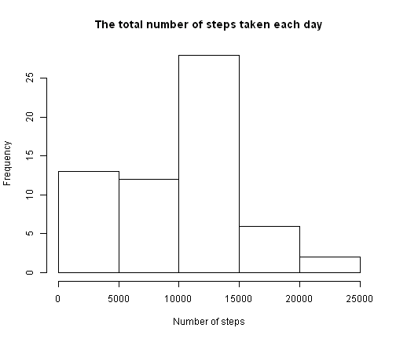
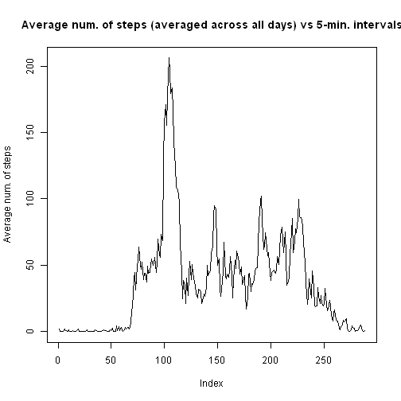
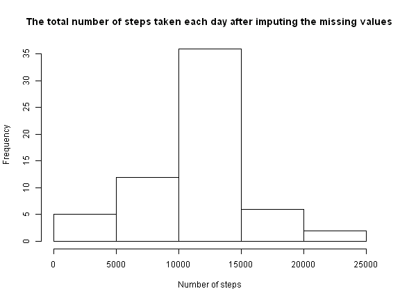
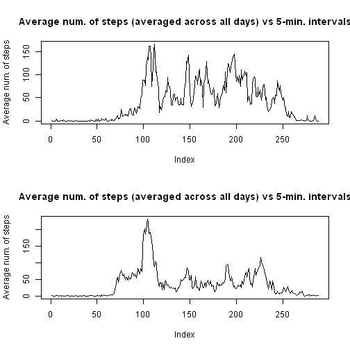

# Reproducible Research: Peer Assessment 1
========================================================


```r
opts_chunk$set(echo = TRUE, results = "asis")
```


## Loading and preprocessing the data

The command below reads the data related to the number of steps taken that are measured in 5-min. intervals for two months and saves the data into the variable "data".


```r
data <- read.csv("activity.csv")
```


## What is mean total number of steps taken per day?

The following makes a histogram of the total number of steps taken per day:


```r
total <- tapply(data$steps, data$date, sum, na.rm = TRUE)
hist(total, main = "The total number of steps taken each day", xlab = "Number of steps")
```

 


To calculate the mean and median values for the total number of steps taken per day:


```r
mean_total <- mean(total)
mean_total
```

[1] 9354


This is the mean number of steps taken per day.
And the median value for for the total number of steps taken per day is:


```r
median_total <- median(total)
median_total
```

[1] 10395


## What is the average daily activity pattern?

The R code below makes a plot of the average number of steps taken in terms of time intervals (averaged across all days)


```r
average_interval <- tapply(data$steps, data$interval, mean, na.rm = TRUE)
plot(average_interval, type = "l", ylab = "Average num. of steps", main = "Average num. of steps (averaged across all days) vs 5-min. intervals")
```

 


The maximum number of steps taken in an interval, on average across all the days in the dataset, is calculated by the code below


```r
max_average <- max(average_interval)
max_average
```

[1] 206.2


To calculate the 5-minute interval, on average across all 
the days in the dataset, that contains the maximum number of steps, we run this code:


```r
max_interval <- match(max_average, average_interval)
max_interval
```

[1] 104

```r
max_interval_minute <- data$interval[max_interval]
max_interval_minute
```

[1] 835


Therefore, on the interval 104 the maximum number of steps, on average across all days, have been taken. This is equivalent to the interval 835 with respect to the formatting of the coloumn "interval" of the data frame.

## Imputing missing values

The code below calculates the total number of missing values in the dataset


```r
good <- complete.cases(data)
t <- table(good)
num_missing <- t[names(t) == FALSE]
num_missing1 <- as.integer(num_missing)
num_missing1
```

[1] 2304


The total number of missing values in the dataset is 2304.

Now we want to fill in the missing data in the dataset. The position of each missing value will be filled with the mean number of steps for the associated 5-minute interval (averaged across all days). It was previously calculated and saved in the variable "average_interval".

We copy the date frame "data" into "data1" and fill the missing positions in data1. data1 would be equal to the original dataset but with the missing data filled in.

Below, the for loop executes the commands for every missing value. The "!good" vector, with "good" calculated above, lets us find the cases of missing value in the dataset. The first command in the loop, takes the mean number of steps, saved in "average_interval", for the interval that is equal to the interval associated with the missing value and saves it into the variable "filling". Then the numeric value of this variable is assigned to the variable "steps" (number of steps). 


```r
data1 <- data
for (i in 1:num_missing1) {
    filling <- average_interval[names(average_interval) == data1[!good, ][i, 
        ]$interval]
    filling1 <- as.numeric(filling)
    data1[!good, ][i, ]$steps <- filling1
}
nrow(data1)
```

[1] 17568

```r
length(complete.cases(data1))
```

[1] 17568

The results of the commands "nrow(data1)" and "length(complete.cases(data1))" shows that no more there are any observations with missing values.

The following code draws a histogram of the total number of steps taken per day for the new dataset with the missing values filled in. Obviously, the distribution of the data has change as a result of filling the missing values.


```r
total1 <- tapply(data1$steps, data1$date, sum)
hist(total1, main = "The total number of steps taken each day after imputing the missing values", 
    xlab = "Number of steps")
```

 


To calculate the mean and median values for the total number of steps taken per day (for the dataset withour missing values):


```r
mean_total1 <- mean(total1)
mean_total1
```

[1] 10766


And the median value for for the total number of steps taken per day (for the dataset without missing values) is:


```r
median_total1 <- median(total1)
median_total1
```

[1] 10766


## Are there differences in activity patterns between weekdays and weekends?

The below code adds new information (in the form of new coloumn) that determines whether an observation has been made on a weekday or a weekend.


```r
Sys.setlocale(category = "LC_TIME", locale = "C")
```

[1] "C"


```r
data1[4] <- weekdays((as.POSIXlt(data1$date)))
data1[((data1[, 4] == "Saturday") | (data1[, 4] == "Sunday")), 5] <- "weekend"
data1[!((data1[, 4] == "Saturday") | (data1[, 4] == "Sunday")), 5] <- "weekday"
data1[6] <- as.factor(data1[, 5])
```


The R code below makes a plot of the average number of steps taken in terms of time intervals (averaged across all days). The plots for weekdays and weekends are separated to allow a better comparison of the activity in weekends and weekdays.


```r
splitted1 <- split(data1$steps, list(data1[, 6], data1$interval))
splitted2 <- split(splitted1, 1:2)
weekday <- sapply(splitted2[[1]], mean)
weekend <- sapply(splitted2[[2]], mean)
par(mfcol = c(2, 1))
plot(weekend, type = "l", ylab = "Average num. of steps", main = "Average num. of steps (averaged across all days) vs 5-min. intervals")
plot(weekday, type = "l", ylab = "Average num. of steps", main = "Average num. of steps (averaged across all days) vs 5-min. intervals")
```

 

